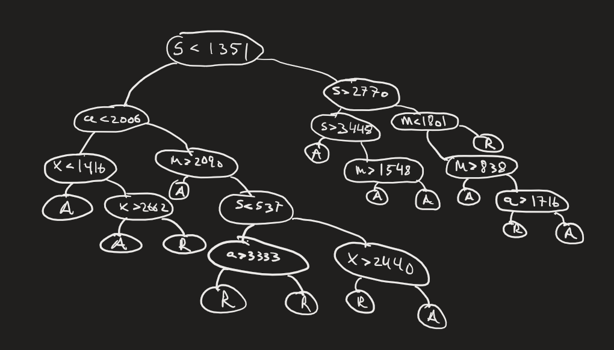

# General thoughts

In addition to the comments in my code I thought it would be good to provide explanations (on a high level) to my solutions and some more general comments, as in the code I try not to make too 
many comments (although they are long on some days) to avoid cluttering. This is basically just me rambling mostly for myself in case I ever come back to this.

---

## Day 1

Straightforward with a twist, where overlapping numbers could occur. I did see this in the example when reading the problem, but because they didn't mention how to handle it I assumed it could be ignored.
Nevertheless, I use [lookahead](https://www.regular-expressions.info/lookaround.html) to catch overlaps, so not much extra work. Lookahead assertion looks like this `(?=B)`, which means that it won't consume the string B if it matches.
Furthermore, instead of concatenating the numbers, which would have been easier, I use the "decomposition" of a number in base 10 to get the total number value.

In hindsight I learnt that python's regex library has a flag to handle overlaps, so could have used it instead.

```python
re.findall(pattern, string_to_match, overlapped=True)
```

---

## Day 2

This was dumb how I split the regex up in 3 cases for each color, when I could have just used OR equivalent in regex `r'(?P<r>\d+) (?P<color>(red|blue|green))'`.
I did think about the OR earlier, but since I'm rusty with regex for some reason I didn't know how to label the capturing group when it had OR inside, which is just the same way as any capturing group.
The way I solve it for part 1 is by creating cube sets, that are just tuples of the number of occurences of the different colors. This is done in each subgame in a game and by zipping
it together (elementwise pairing) with the color limits for each game, I can check if a game is valid or not by checking if each subgame fulfills the color limit. The built-in method All() is used for this purpose, which is really handy, 
as I think don't have to save the booleans as local variables or in a list (well I still do in a list, but the evaluation is easy with all()).  

For part 2 the problem was different, but luckily I could still use my representation of the cubes and the games to solve it in one line. The problem now is
to determine how many there are **at least** of each color in the bag for each game based on what you've seen in that game. But what's strange is that there is no upper limitation now on the cubes compared to part 1. 
So while you can't know the exact amount, you can still look for how many there can be at minimum (greatest lower bound or infimum), 
so logically speaking it must then be the maximum of what you saw in each game.

---

## Day 3

For this I thought about 2 approaches: 
1. look around each symbol and find the adjacent numbers
2. or for each number look around to find a symbol. 

I went with the second one, because I thought it would be easier for me to code as I didn't want to iterate forward and backwards to check adjacent numbers from a symbol.
In approach 1, this would manifest in more dx, dy coordinate offsets to check for numbers (at least the way I thought about doing it), so approach 2 was better for me.
One thing I then did for part 2 was to continue my approach of iterating through each number and checking potential adjacent symbols, but now also adding their positions into a dictionary, 
where key is the position and values are the numbers adjacent to the symbol. I could then easily just filter out the ones with length greater than 2.

What I learned:
* Directions, especially going up,down,right,left and also diagonally can easily be generated with list comprehension as (dx, dy) form. That way don't need to write them out explicitly
* Another approach is to work with complex numbers instead, helps since you can do easy inline additions and subtractions to manipulate coordinates and also flip orientations if necessary

---

## Day 4

Not much to say here, just count the number of winning numbers there are in each scratch card and follow the formula to calculate the total value.
For part 2, just make sure to add the upcoming cards correctly with correct indexing. Python has a cool trick to repeat elements in a list similar to Haskell, except it's not lazy `[element] * n`,
where element is an object or primitive type and n the number of times to repeat it in the list. I used this to store card occurences.
However, one can generate lists lazily with itertools.repeat if so desired.

---

## Day 5

A noticeable bump in difficulty this day in part 2. Because it's apparent that it will be infeasible to work with such large lists, I decided to work with intervals (as tuples for instance) instead. Here I consider for instance seed-to-soil map a map and the associated mappings as map entries. 
Part 1 is straightforward, just iterate through the maps, make sure to convert it correctly, and you will be good to go. 
For part 2 I had troubles with by-one-off errors (because of destinations, sources and ranges) and had to doodle to identify potential weird edge cases when splitting a range into appropriate intervals. 
One important insight, which perhaps isn't necessary but made my code shorter, is to sort map entries for each map by source. This together with the fact that each map didn't have any holes (I verified by checking the associated map entries) made it so that each time
a range overlapped with a map entry in a map, only one new interval was created (by splitting the original range) and the rest of the interval was queued to be processed with the rest of the map entries.

What I learned:
* Kind of reminds of me coordinate compression, because we are just working with the intervals (ranges) without explicitly working with the elements in the range. But it's a bit simpler here (1-dimensional), since we are only interested in the end points of the interval and if something is inside the interval we will split it appropriately

---

## Day 6

Short problem, just brute-force it by trying all possible times to hold the button. There was also a nice mathematical solution based on high school math: searching between the intervals of the solutions (roots) of the quadtratic inequality 

```math
(time - x) * x = x * time - x^{2} > distance \iff x * time - x^{2} - distance > 0
```

which is calculated with PQ-formula (swedish) and [reduced quadratic equation](https://en.wikipedia.org/wiki/Quadratic_equation#Reduced_quadratic_equation) in english. Alternatively one could use
the other [variant](https://en.wikipedia.org/wiki/Quadratic_equation#Quadratic_formula_and_its_derivation), which seems popular in US to my knowledge.
So this could be solved with just a calculator, don't even need to code.

---

## Day 7

Brute force solution would be something like O(kn^2) = O(n^2), where k = 5. Since n=1000, it should still be
sufficient (within a few seconds at max). Hardest part for me was assigning the types to the cards in a concise way.
Wanted to skip lots of if else conditions, so I found one pattern that was unique for all of the different types. The
number of pairs, non pairs and the length of the most frequent letter in the current hand together formed a unique
combination for a type. I use groupby after sorting the hand to group same letters together and then take the length of them in order to calculate the occurences of each type of letter in a hand. 
Also for part2 only needed to change the type of cards, and it sufficed to change the cards
by replacing the most frequent letter with J (only for when determining the type and I checked that it didn't lead to
any weird edge cases), but the for the rank calculation, the original cards were used.


What I learned:
* If you don't care about readability to avoid lots of conditionals can just use dictionary
* There's a library to do what I tried to achieve with groupby + sorted + len to get the number of occurences of each letter in a hand, which is the Counter method from collections

---

## Day 8

Was thinking of some contrived algorithm to do part2, where I try to remember the paths from a start node to a
node ending with 'Z' by storing tuples in the form (start point, directions to reach the node ending with z from the
start node) as keys and val as steps to reach the node (e.g 'LLLRLL'). That way I could increment the
steps (jumping ahead) once I knew I had already walked that path. In worst case this would blow up the memory and it
would work poorly if one node visited a node ending with 'Z' at the end, or if the steps were just too low to make an
impact. So I had to verify if this was feasible by checking when the each node first visited a node ending with 'Z',
which turned out to be a constant cyclic number for each node (each node with it's own constant cyclic number).
Knowing this I realized that I could simply use [lcm](https://en.wikipedia.org/wiki/Least_common_multiple) to calculate the answer.

What I learned:
* First puzzle that made me realize that in aoc it can sometimes be worth it to check your assumptions against the input if it makes the solution much easier. Here the assumption was that there might be constant cyclic number for each node, which turned out to be correct.

---

## Day 9

Not much to say, straightforward brute-force implementation
in hindsight could have reversed the sequences for the second part (although I did reverse it at some point, but only to avoid going backwards in the loop...) .
Also one liners functional style would be more readable for this problem or use recursion.

---

## Day 10

Naive, slow and tedious approach for part 2 (around 1 minute to execute): At a high level this is what is being done:
1. Mark the pipes in the main loop with 'M' to denote main. For part 1 just count the pipes by following the path from the start node, round down and divide by 2 to get the distance (divide by 2 because of symmetry going clockwise and counterclockwise)
2. Then pad the maze by naively adding # to each location in the grid, while making sure that the pipe connections are intact. This is so I could mark the nodes that were outside (padding
allows possible paths going outside the maze to connect with the outside nodes). For every other row I had to add a new row to enlarge the maze for the vertical gaps.
3. Finally, I used BFS flood fill to find the outside nodes by padding the edges and starting from those edges to avoid accidentally starting inside. Then check for nodes not in the loop, not being the padded characters and not being outside to find the inside nodes. 

The padding is a bit more involved. There were two types of padding I did, horizontal and vertical. 
Horizontal would look something like this:

    original row `.S-7.`
    after padding `.(#)S(- M)-(- M)7#.#`

Vertical would look something like this:

    add entire new row for every other row `#######`
    add necessary pipe connections as second vertical padding `##(| M)##(| M)###`

where parenthesis is just for emphasis of change, parenthesis were never really included. `- M` `| M` is to denote members of main loop horizontally and vertically respectively, but in hindsight it would have sufficed to just replace with `M`, because the BFS flood fill is only concerned with whether a tile is a pipe in the main loop or not. 
The most important part to explain is that I had to do vertical padding, followed by horizontal, followed by vertical. The second vertical padding was because horizontal padding would offset the original positions of the pipes in the main loop, 
and because there was no way of knowing how it would offset them and by how much in advance, I needed to do the horizontal padding at the same time as the second vertical padding to compensate for this. I think in retrospect that I could probably have done the entire vertical and horizontal padding at the same time, but I don't fully remember if there were some strange edge cases that would make it not work. 

In hindsight saw that there were some geometry algs that could have made the solution significantly shorter, especially the scanline and the even/odd
parity approach or picks + shoelace or even greens/stokes theorem.

Had to draw the enlarged maze to understand how the gaps were filled. After padding on the left and before padding on the right, but enlarged to show how the gaps are supposed to look like. Note that the left picture doesn't contain any `| M` or `- M`, and that's because when I was just trying to make the padding work I needed to do it properly by
padding connected pipes with the correct vertical or horizontal pipe, which was either `-` or `|` for horizontal and vertical pipes respectively. This made it easier to visually verify if the padding was correct.


What I learned:
* There are always cool algorithms when it comes to geometrical problems
* Deepcopy is needed when using nested lists, list[::] only works for 1D arrays, so it's a shallow copy
* Use list("<some_string>") if want to mutate specific entries in a string, since strings are otherwise immutable

---

## Day 11

I think I tried a naive BFS for this one at first, but turned out infeasible, so I switched approach (day 10 probably influenced me a bit). Realized I could just use manhattan to calculate the distances.
Only tricky thing was to realize that for part2 didn't need to actually append 1000k lists, instead just offset the original galaxy indicies. Also used numpy to easily get indices of the galaxies with np.find().

What I learned:
* If something is grid-like, directions to move only allowed is north,south, east and west and we want to calculate the distance between positions in the grid, then use manhattan
* Obviously when there are lots of elements added, then it's a give-away that need to do some trick. Here the trick was to work with the indices by offseting them instead of working directly with the enlarged grid

---

## Day 12

This was the first puzzle I had to look for hints. Haven't done DP in a while, so needed to refresh my knowledge.
I initially implemented it without memoization. Had to get some hints on how to convert to using memoization. Turns out the only thing needed to do was to implement it without explicitly
generating the arrangements, by going one character at a time and check on the group condition each time a group is
completed. For the memoization use a cache decorator to memoize function parameters each call. credits to [pred](https://www.reddit.com/r/adventofcode/comments/18ge41g/2023_day_12_solutions/kd0dw9e/).
The problem with my initial solution was that it gave unique function parameters each call, since it generates all permutations of the
arrangements, this means that caching the function parameters doesn't help (they will be unique everytime).

What I learned:
* Had to refresh DP, which still wasn't enough. I guess I just don't fully understand it, or I need to practise it more
* Bottom-up DP seems harder to come up with sometimes than top-down memoization, which seems a bit more natural
* Use @cache to save function parameter calls, that way if same calls are executed we will just use the cache


---

## Day 13

Zip helped alot here. Iterated through all possible reflection lines and
for each candidate line used zip to pair the rows and cols respectively. The only tricky thing was getting the
indices correct for zip to work. For part2 a key insight that made it easy was that only needed to find exactly in
total 1 character difference between all pair to find the desired reflection line. A cool trick to check the 1
difference is to sum over all booleans, since False gives 0 while True gives 1, so there should only ever be 1 True
value for the reflection line that is the desired one.

What I learned:
* Seemed like some kind of palindrome problem. Zip is very useful sometimes
* Forgot you can sum booleans, which is a nice trick to know

---

## Day 14

Credits to [i_have_no_biscuits](https://www.reddit.com/r/adventofcode/comments/18i0xtn/2023_day_14_solutions/kdbwi4k/) for showing a nice one-liner for sliding the rocks. Wanted to do this more functional style, so I had a
groupby approach: [''.join(list(group)) for key, group in groupby(input_string, key=lambda x: '.' in x or 'O' in x)]
, but didn't think about split at all. Reason why need to tuple the lists is to be able to hash the grid in a dictionary as
key (lists arent hashable). One thing to note for the cycle detection is that the there's a rampup before entering the main cycle,
thus explaining the extra subtractions being made on the mod.

What I learned:
* I could have used numpy for this as well because it has built-in rotation methods, but the rotations were all one-liners so didn't matter
* It's good to be aware of string manipulations techniques
* Was nice to learn a more functional approach to this problem, made it much shorter and elegant. I already know this about functional programming, but I've forgotten all about it since it was such a long time ago.

---

## Day 15

One of the easier puzzles overall, but unecessarily wordy (undestanding the problem was harder than implementing it),
could have been day 1-3. All the instructions and edge cases where already given in the puzzle, so it was just a
straightforward implementation.

What I learned:
* Not much, but was nice to see an obvious use of reduce here
* Also, defaultdict is nice to use if you don't want to handle cases when the key doesn't exist, just let the defaultdict assign a default value that you choose. This would have made the code a bit shorter.

---

## Day 16

Pure imperative this time, not functional style at all as I couldn't think of smart tricks to do it. I used numpy
for ease of extraction of columns. This was basic traversing by following the path, but the directions we go
are only determined by the mirrors we encounter. One could probably memoize the energy that each paths contribute
with, but brute force still works within a few seconds. Also horrible code, due to axis flags this results in
infestation of conditionals for index assignments, although only one liners luckily with inline conditional.
Grid_for_marking is only for debugging purposes.

What I learned:
* Here I could have just saved all the tiles instead of just the mirrors. I think it would have sufficed to check the direction on a tile because that should be unique I think, so if it has been visited, then skip the path.

---

## Day 17

For some reason I couldn't get my Dijkstra to work no matter what I did, so had to look this up. Creds to
[HyperNeutrino](https://www.youtube.com/watch?v=2pDSooPLLkI&t=527s).
My problem was how I stored visited nodes, thinking it was sufficient to only store the node itself, but that wasn't the case.
It helps to think of it as moving in a 2-dimensional space but the visited state space is a 5-dimensional space (if you collapse node coordinate and direction) and not 2-dimesional anymore (node coordinate),
so everytime there is a unique arrangement of the 5 variables it needs to be added to the queue as a distinct entry.
This also means that unlike the traditional Dijkstra we can revisit nodes (by taking a different path).
If a different path leading to a node is better, then that will be prioritized in the queue, other paths that are worse will be sorted with lower priority.
This together with being able to revisit nodes, helps escape situations that go down a path that seems at first optimal but in the long run is sub-optimal.
It should be a straightforward Dijkstra but the modifications needed are
1. Store each state as (cost, node_pos, direction_where_you_came_from, steps_taken)
2. Save visited as (node position, direction_where_you_came_from, steps_taken)
3. Adding extra conditionals to make sure not to violate the step conditions

For this implementation don't even need to keep track of a distance array/dict, just put it into the priority queue, and if correctly implemented,
should always give the least amount of heat to reach the given node the state it's associated with. Because the
priority queue will always sort in descending order that means as soon as we reach the target we will get the least
amount of heat and we are done. We would have needed a distance array if we somehow wanted to know the lowest heat for more than just the target tile. 

---

## Day 18

As with any geometrical problems you can get really creative if you want to. I cheesed it and went with [shoelace](https://en.wikipedia.org/wiki/Shoelace_formula#Shoelace_formula) + [pick's](https://en.wikipedia.org/wiki/Pick%27s_theorem) theorems, which I became aware of on day 10, which made it so much easier, actually easier than day 10. Since my brute-force approach from day 10 wasn't pleasant to work with I didn't even bother trying. Although flood-fill and marking logic for the boundary would be the only thing I would be able to reuse and not the tedious padding logic. Nevertheless, it wouldn't have worked for part 2.
Only extra work aside from applying the shoelace + picks was to first convert the instructions to vertex coordinates, which was also straightforward with a dictionary, where value was in (dx, dy) form.

The simple rewrite of pick's theorem is the following, given that we are looking for both the inner points (number of points inside the # blocks) and the boundary points (total # blocks), denoted as i and b respectively we have:
```math
A = i + \frac{b}{2} - 1 \iff i = A - \frac{b}{2} + 1 \implies i + b = A + \frac{b}{2} + 1
```

In the formula for shoelace the area we are calculating constitutes A and the total steps taken which is just the total # blocks constitutes b. As can be seen with a simple rewrite we can get a formula for the desired total area, where we have access to all the variables in order to calculate it, which is A and b.
For intuition as to why we have to add shoelace with $\frac{b}{2} + 1$ can be found [here](https://www.reddit.com/r/adventofcode/comments/18l0qtr/2023_day_18_solutions/kdvs6lr/).

---

## Day 19

This day was kinda similar to day 5, in that we had to work with intervals instead of the direct numbers in part 2, because otherwise it would be infeasible.
First thing I thought of was to implement it as a binary tree, where a condition that is true is to the left of the tree and false is to the right, but I realized that I would need to add the entries in order, which I didn't bother with as that would require a transformation of the original input in some way, or writing some recursive function to add them in order, but by then I could have just solved the entire thing.
So instead, I thought it would suffice to go with a list of dictionaries associated with lists of workflow entries (hoping that the depth wouldn't be too high), almost exactly as presented in the input `[workflow_name: [WorkflowEntry]]`, where a WorkflowEntry contained all the necessary data for that entry, such as the conditions (modelled with rule object) and the workflow name it is associated with (destination).
For instance, the very first entry in the 'in' workflow would contain the following data, encapsulated inside a WorkflowEntry object `rule: val: 1351, category: s, op: <built-in function lt>, destination: px`. Admittedly, bit more OO than previous days (still not much OO honestly), which made the code longer due to boilerplate, but wanted to avoid long tuples.
As for the parts, there were just dictionaries as presented by the input.

Before discussing part 1 and 2 I drew a visualization of the sample input, that helped me immensely with designing and debugging the algorithm.



A is accepted and R refused. The left side of any subtree constitutes the condition (the node) being true and the right side is when it's false. Even though I modelled it as a list of dictionaries, the way we traverse the lists and the dictionaries has the same effect as the binary tree, in that each path introduces non-overlapping "combinations", which makes the calculations so much easier to deal with.

With this in mind, part 1 was just straightforward brute-force: follow the paths determined by whether a condition is fulfilled or not given by the workflowEntry and the given part data, and if it's accepted (we reach the A nodes in the picture) then add it.
For part 2, in order to avoid working directly with the numbers, just work with intervals instead, much in the same way as day 5, but easier today, as we are only looking for distinct "combinations", and the key method to calculate the total number of these is to use [rule of product](https://en.wikipedia.org/wiki/Rule_of_product), which is very natural to think of.
For instance, an accepted path is one that fulfills `s < 1351, a < 2006, x < 1416` (the very left side) and m must be `1 <= m <= 4000`, which gives the intervals `s: [1, 1350], a: [1, 2005], x: [1, 1415], m: [1, 4000]`, so the number of distinct combinations for this path naturally is $1350 * 2005 * 1415 * 4000 = 1.5320205e+13$. As can be seen, there are some off-by-one errors that are easy to make if not cautious, but other than that the principle that the algorithm builds on is very intuitive and nothing fancy.
This makes it so that the code only needs to find all accepted states, calculate the "combinations" and add them up. 

Also, should say the get_all_accepted() method is very ugly recursive function, as I had to add the negation of the conditions for part 2, but couldn't find an elegant way of doing this, thus had to work with two lists. In short, c list is to keep track of negated conditions in addition to the current path, e.g `s < 1351` becomes `s > 1350` when iterating through a workflow list, and the candidate list is to try potential paths that may result in accepted.
The reason to keep the lists apart is to not pollute the current path with candidate workflow names that don't result in accepted, that's the gist of it.

All in all, very intuitive to design a solution, but annoying to implement because of the potential off-by-one errors.

---

## Day 20

I went full OO on this day as it was such an obvious OO problem (although, could have used dictionaries for the modules instead). Part 1, despite being long with some requirements, was still straightforward to solve with OO. I didn't have to think much other than following the requirements, and also seeing how the order of the pulses could be directly replicated with a queue made it easy to code the simulation of the runs.
Part 2 wasn't as obvious, but having done day 8, I directly thought of using [lcm](https://en.wikipedia.org/wiki/Least_common_multiple) in some way. However, compared to day 8, it wasn't as obvious what exactly I would keep track of, so once again I needed to look at the input data in hopes of finding some pattern I could use for lcm. 

So, in my case the rx module was connected by df conjunction module.
For a conjunction module to emit low pulse it has to basically receive high pulses from all the modules sending to it, meaning that I needed to look at the modules connected to the df conjunction module. 
As can be seen in the code and the input gp, ln, xp and xl where the only modules connected to df, and they all were conjunction modules as well. This means that they all needed to send high at the same time in order for df to send a low pulse.
As in day 8, I assumed that there weren't any start offset in the cycles, so I just counted the number of button presses similar to how I counted the steps on day 8. This turned out to be no more than 4057 button presses (less for the other modules), so it terminated sufficiently fast, less than 1 second, and gave the correct answer by running it on lcm.  

Luckily there weren't any offsets (otherwise I think that [CRT](https://en.wikipedia.org/wiki/Chinese_remainder_theorem) would have been required), and there weren't any complex cycle patterns, so this day was in a way a repeat of day 8 with a little twist.

What I learned:
* A greater appreciation for dataclasses, because of how much boilerplate it reduces.
* Learned that you have to be careful with inheriting from a parent class that has default fields, while deriving classes have non-defaults and defaults, because of the order attributes in classes are read (from top to bottom), all deriving classes must also have default values as attributes.
This can be resolved by setting kw_only=True in conjunction with dataclass or in field(). Although in this case I luckily didn't encounter this situation, so the places I put kw_only is not really necessary.
* Use default_factory in field() on attribute you want to have mutatable default values such as dictionary or list.

---

## Day 21

I cheesed it this day, as I already knew what to do because I had already seen the memes. Part 1 is trivial, just use BFS or some other way of adding the coordinates. Instead of using a queue I used sets to avoid O(n) for checking for duplicates, I don't really think it mattered. So, like a BFS I look at all possible directions of a given coordinate and add them into the set.
For part 2 I knew the magical number of 65 steps (to reach the diamond shape) and the two additional steps 65 + 131 and 65 + 131 * 2. So, I simply just input these steps into the method from part 1 to retrieve the number of garden plots. These numbers were then used to calculate the quadratic equation by using [lagrange interpolation polynomial](https://en.wikipedia.org/wiki/Lagrange_polynomial) or [vandermonde matrix](https://en.wikipedia.org/wiki/Vandermonde_matrix).
There's alot to say about how people came up with the numbers, but I don't think I understand it enough (or maybe I'm just too lazy to try to understand it right now) to explain it here.
So instead I'll refer to [this](https://www.reddit.com/r/adventofcode/comments/18ofc8i/2023_day_21_part_2_intuition_behind_solution/) by Thomasjevskij, if future me one day wants to understand it.

---

## Day 22

Fun day, I've never implemented a Jenga-like puzzle before, so was cool to see that it's not that hard (although this is very simplified). However, I think my implementation needs some explanations, as I think I overcomplicated it.

The objects:
* Used a zero 3D numpy array as a state array to keep track of where the bricks moved. Stored non-zero ID on the coordinates that the bricks occupied, so they were duplicated. This was something I had to watch out for later.
* A dictionary for bricks in case I needed fast lookup
* A list of all the bricks
* Stored x,y,z coords as tuples in sand brick objects, ID and bricks that supported them. I thought it was strange to store the coords as tuples, but couldn't figure out a better alternative, as one of the coords is always a tuple because of its length, so I didn't want to store the full coordinates in a list. For instance x=(0,2), y=(1,1), z=(2,2), if stored as full coordinates would be [(0,1,2), (1,1,2), (2,1,2)],
which is much more verbose than storing them as tuples. I think the reason I went with tuples was because numpy arrays can accept tuples as indices to extract entries in a numpy array, and if there is a range, which there is in this case, x=(0,2), I could just use range(0,2+1) to get the correct indices for that axis. So the full extraction of the brick from the 3D array, let's call it grid, would be `grid[range(0,2+1), 1, 2]`.

***Moving the bricks*** 

Store the snapshot of the bricks positions in the 3D array and let each brick fall down. A brick moves as far down in the z-axis as possible until it makes contact with another brick.
Bricks that are on z=1 are already settled. I sort the bricks in ascending order, as that makes it so much easier to figure out their final positions, because bricks closest to the ground, if not already on the ground, are the ones that settles first. 
At each z-level, bricks that are at the same z-level will not bump into each other when falling per the problem description. That means that the order in which bricks at a given level are considered does not matter, only thing that matters is that they are iterated in ascending order w.r.t the z-axis.
When a brick has settled remove it's original position in the 3D grid and add the new position by populating the coordinates by its id. Also a brick that has settled can store the bricks immediately underneath it in the supported_by attribute, to keep track of bricks that supports it. This will be helpful for part 1.   
I also count the number of bricks that fell, but that is only relevant for part 2.

***Part 1***

Counting the bricks that don't cause any falling is done by considering all bricks one z-level **above** the given brick that are in contact with it and checking that they **all** are supported by **more than one brick**. That way if the given brick is to be removed the ones on top of it won't fall.
If there are no bricks above the given brick, then naturally it can be removed. All this is made possible with ease because I keep track of bricks that supports a brick. That's pretty much part 1.

***Part 2***

Initially I was thinking of some contrived way to make use of the supported_by attribute in the sand bricks, but realized it would be pain to simulate the chain reaction. So I went with a brute force approach: for each brick, remove it from the grid and let all the bricks settle, count how many falls and that will be the desired number for a brick. Do this for every brick and add the numbers together.
That's all. It's undoubtedly slow, 40s, but it's such an easy implementation compared to trying to make supported_by approach work, which I'm not sure how. 

---

## Day 23

Absolute shitshow of a day and code (many duplications). Part 1 was easy, straightforward DFS, keep track of path length for each possible path taken to the end, and make sure to remove the vertex in the correct order after the recursive call, so we can backtrack properly.
Part 2 was trickier, longest path problem for an undirected general graph is [NP-hard](https://en.wikipedia.org/wiki/Longest_path_problem), so there's no polynomial time solution. So the easy way is to just brute-force it again with DFS but with some smart tricks. I ran it while thinking of a solution, but by the time I had a solution (a few hours later) it was still running, so the naive DFS wouldn't work on, at least on python.
What I realized was that the paths in the grid resembled long corridors with junctions. So I just compressed the graph, only keeping the start, end, junctions and the edge cost to reach the junctions. This would give a graph with only 35 nodes to work with compared to 9400 nodes. I used a simple BFS to visit all paths and create edges in an adjacency list. The BFS method was a bit tricky for me as I never found the
bug which caused it to never end. I mitigated this by adding a max iter condition, as I suspected that it was working correctly but for some strange reason got stuck in a cycle (?) towards the end. Also, I realized that I never added the end node, so I had to do this manually, by COUNTING the nodes to the last junction. This was so dumb, but it worked in the end. I will have to come back to this one sometime in the future to fix the bug.


---

## Day 24


---


